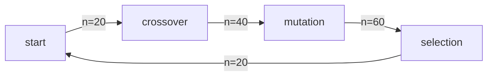

## Implementation of Genetic Algorithm

### Basic Information

- mutation rate = 0.1
- population size = 20
- individual  with the smaller function value gets better fitness score

**Change of the number of individuals:**

### Selection

In my implementation, I use roulette-wheel selection for selection. With this method, every individual in the population has a certain chance to be chosen, but the probability is different. Specifically, in each iteration, there will be n individuals in the population, among which the individual with the smallest function value has a score of **n**, and the i-th smallest score is **n+1-i**. The probability of each individual being selected is proportional to their score.

### Crossover

The chromosome of an individual actually represents its value. So it is natural to use single-point crossover. In each iteration, two individuals will be randomly selected and a single-point crossover will be performed at a random point. These two individuals will not be put back. By doing this, we actually swap two floating numbers from a specific bit.

### Mutation

In fact, a single point mutation has little change in the value of an individual. Therefore, I use an improved single point mutation instead. That means applying addition and subtraction to a certain bit (with carry). Compared with ordinary single point mutations realized by flipping, such mutations can apply addition to a '1' bit and apply subtraction to a '0' bit.

### Stopping criterion

Firstly, I use a counter to count how many iterations have passed since the last time minimum is updated. Since the mutation rate is 0.1 and we have 20 population and 16 bit, when the counter exceeds 100, we can assert that we have at least got the **local minimum**. However, that does not guarantee that we will get the **global minimum**. So, we still need enough iterations to **'cross'** the local minimum. Through experiments, we can find that 5000 iterations can guarantee to cross the local minimum.

### Some interesting points

- I have also considered using different mutation rate for different positions, or using a decaying rate to change the mutation rate. But experiments show that if you want to cross the local minimum, the probability of mutation should not change with the bit position or the number of iterations.
- Another interesting point is that any analysis (such as mean, variance, etc. ) of past few samples can only determine whether it is a local minimum. It is still possible that the global maximum is not obtained. The most effective way to solve this problem is to increase the number of iterations.

